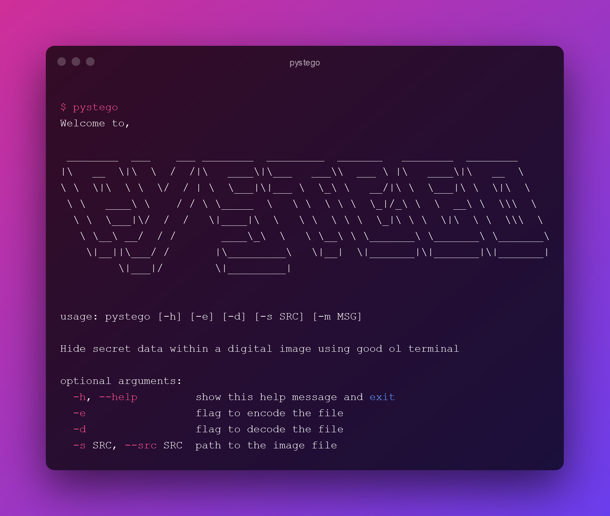

# pystego
Hide secret data within a digital image using good ol' terminal



## Installation
The recommended way for installing this package is using, python PIP, package installer for python or git. Ubuntu or Debian users can install them using `sudo apt install python3-pip git`. After installing pip run this command,
```
pip install Pillow numpy # install required packages
pip install git+https://github.com/GuptaAyush19/pystego.git
```
Users can also install this manually by downloading the zip file from [here](https://github.com/GuptaAyush19/pystego/archive/refs/heads/master.zip), extracting it and running this command inside the project directory,
```
python setup.py install
```

## Usage
Upon installation and packages all setup, the package can now
directly execute using the command given below. Note that this is os independent which means it can run on both linux and windows.
```
# encode using message as an argument (not recommended as this will be saved in your terminal history)
pystego -e -s <PATH_TO_FILE> -m 'hello there'
# decode
pystego -d s <PATH_TO_FILE>
```

Flags and arguments:
1. `-e` => flag to encode the file
2. `-d` => flag to decode the file
3. `-s` => path to the image file, also referred to as source/src

## Example

The following shows an example of encoding and decoding a message using `-e`, `-d` and `-s` flag only. Enter the message once the prompt `ENTER MESSAGE:` is visible. 
### Encoding
```
$ pystego -es resources/hacker.png
INFO:root:ENCODING `resources/hacker.png`
ENTER MESSAGE: this is something else
DEBUG:PIL.PngImagePlugin:STREAM b'IHDR' 16 13
DEBUG:PIL.PngImagePlugin:STREAM b'IDAT' 41 65536
SUCCESS: Image Encoded Successfully @ resources/hacker.png
```
### Decoding
```
$ pystego -ds resources/hacker.png
INFO:root:DECODING `resources/hacker.png`
DEBUG:PIL.PngImagePlugin:STREAM b'IHDR' 16 13
DEBUG:PIL.PngImagePlugin:STREAM b'IDAT' 41 65536
SUCCESS: Image Decoded Successfully @ resources/hacker.png
→ this is something else
```

## TODO
- Implement file encoding into digital images
- Save the output message into another standalone file
- Implement encryption of the original text for better security
- Documentation for pystego module

## License
This repository falls under [GPL-3.0 License](https://github.com/GuptaAyush19/pystego/blob/master/LICENSE)
